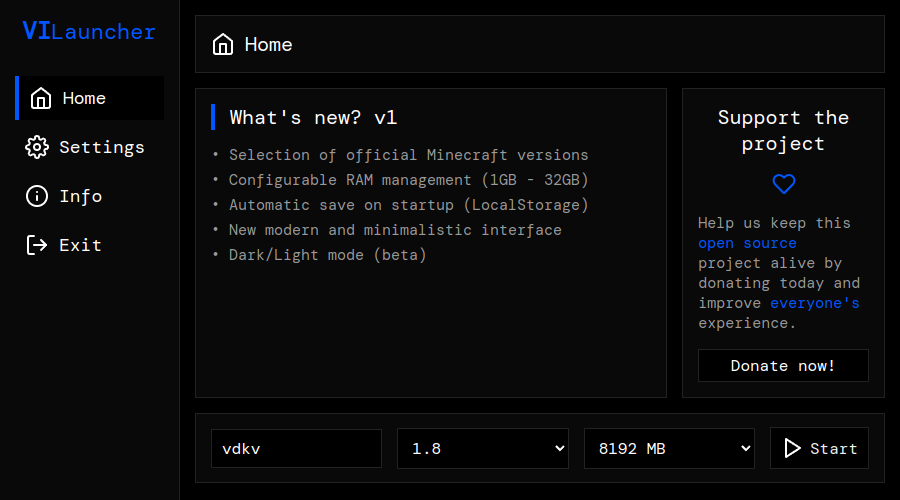

# 🚀 VILauncher - v1

<div align="center">
  
</div>

## 📋 Description
VILauncher is a custom Minecraft launcher, developed with modern technologies that offers a smooth and user-friendly experience to start your favorite game. Built with **Node.js**, **Electron** and **minecraft-launcher-core**.

## ✨ Key Features
- 🎮 Official Minecraft version selection
- 💾 Configurable RAM management
- 💫 Modern and minimalist interface
- 💡 Automatic configuration saving
- ⚡ Quick and efficient startup

## 🛠️ Installation

### Method 1: Direct Installation
1. Download the installer from [vilauncher.vercel.app](https://vilauncher.vercel.app/)
2. Run the `.exe` (Windows) or `.AppImage` (Linux) file
3. Follow the installer instructions

### Method 2: Development
```bash
# Clone the repository
git clone https://gitlab.com/VIfront/vilauncher.git

# Install dependencies
npm install

# Start in development mode
npm start

# Build for production
npm run build
```

## 💻 System Requirements
- OS: Windows 7/8/10/11 or Any Linux
- Java Runtime Environment (JRE)
- Minimum 1GB RAM available

## 🔧 Configuration
1. Enter your username
2. Select desired Minecraft version
3. Adjust RAM amount according to your needs
4. Press Start and enjoy!

## 📝 Developer Notes
- The `node_modules` folder is not included in the repository
- Make sure you have Node.js installed on your system
- Run `npm install` after cloning the project

## 🔒 License
This project is licensed under the GNU General Public License v3.0 (GPL-3.0).
For more details, see the [LICENSE](LICENSE) file in the repository.

## 📞 Contact
- 📧 Email: vdkv@proton.me
- 💬 Telegram: @vdkv000

## 💖 Support the Project
If you find this project useful, consider making a donation to keep development active:
- Bitcoin: `bc1qsq27ruvlq7fpyaen5vwcl4gqx2xqsx7r52tw7s`